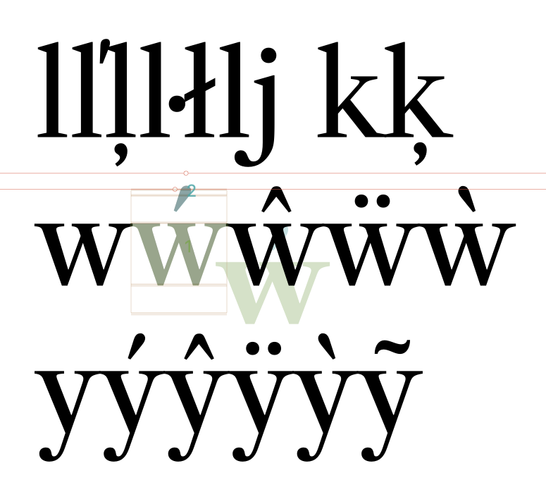
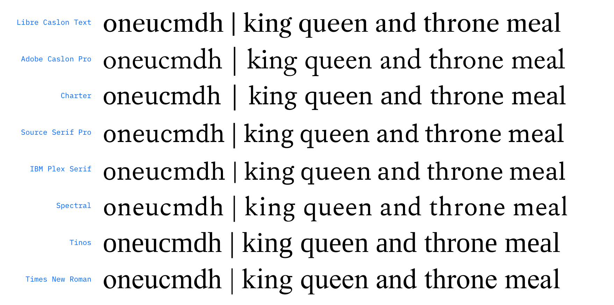
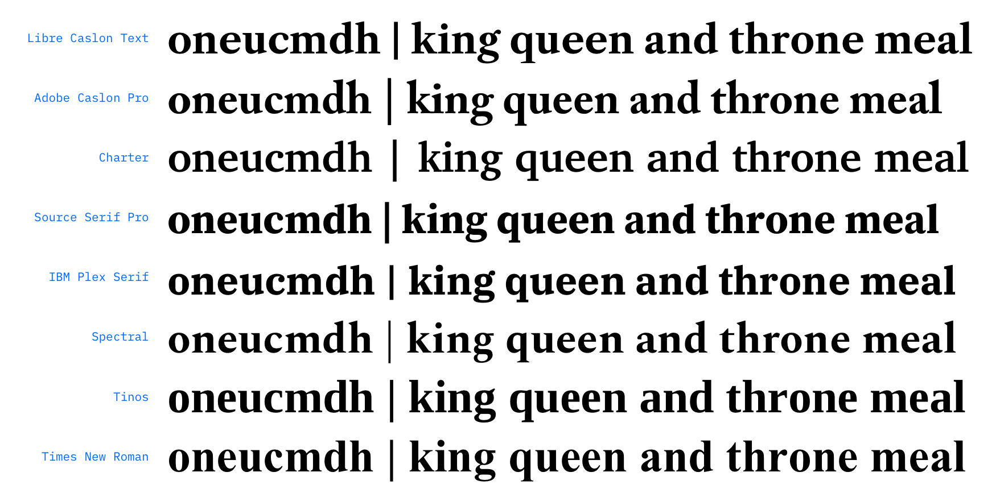
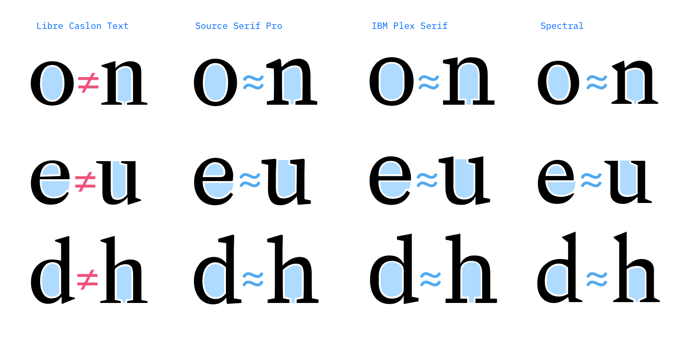
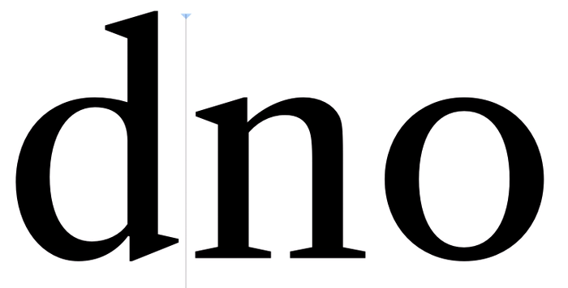
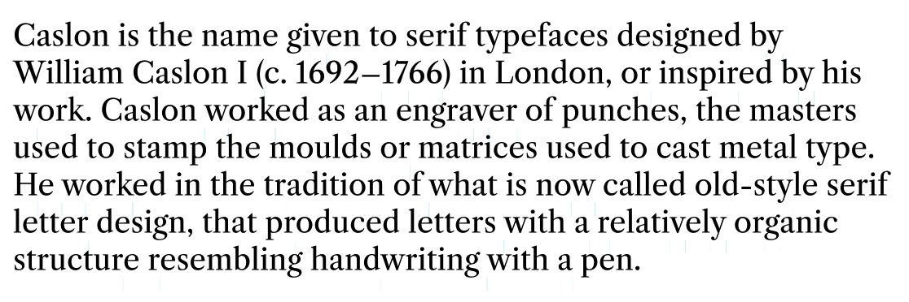
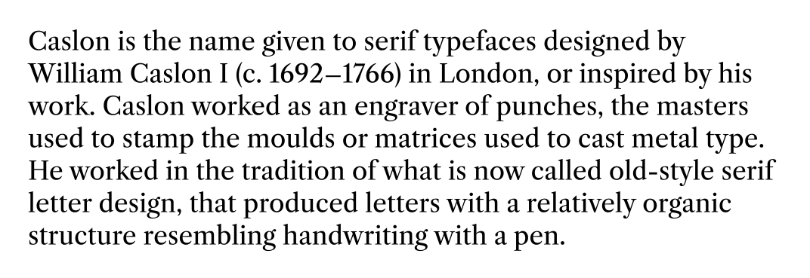

# Spacing Improvements

This font has quite a few issues with proportions and spacing.

I am avoiding changing it too much, because Dave has specifically asked me to keep a narrow focus on production as a variable font, for now, and stick to the original designs closely. 

However, a few things need to be fixed to prevent this from being a really awkward-to-use font.

## Adding kerning to "non-ligated sequences"

Overall, `k` was too-open on the right side. I reduced its right sidebearing, and kerned it a bit more tightly against glyphs `/a /f /t`. 

Before:

After (kerned in different lowercase combinations, mostly based on "nn" and "oo" spacing):

I also reduced sidebearings in diagonals: `/y/v/w`, as these were all quite loosely-spaced. 

This font could probably benefit from a more-methodical overall spacing upgrade, but that goes beyond the scope of this "just get it published" project, as it might also call into question the overall widths of some letters.

## Matching `/l` shape with other lowercase letters

Previously, the Text Roman `/l` had a thinner stem and smaller serifs that other lowercase letters, like `/i` and `/h`. To better match sizing and spacing, I duplicated the main contour of the `/i` and matched its spacing. This brings the `/l` more in line with other ascenders, and increases its overly-tight spacing somewhat.

Before and after:

## Bringing spacing updates to component glyphs

By default, the spacing updates in foundation glyphs are not being automatically pulled into accented variants. Probably a script would work well to update spacing of these glyphs (skipping the `i`-based letters).

Relevant for: `/l /k /y /v /w`

- [x] ~~check on this~~ it was necessary to turn on "automatic alignment" to bring in spacing updates

## Adjusting the widths of several lowercase letters to improve overall consistency of counters in text

_(This is a post-[PR](https://github.com/google/fonts/pull/1787)-approval update)._

There's a lingering issue of spacing – so just before we merge it and publish it to be used in a bunch of websites, I want to adjust it slightly. It's a small set of changes, but they will/would reflow text significantly.

Specifically, my early proofs showed that there was some inconsistency in the interior spaces of letters, most noticeably with n, u, m, & h being somewhat more condensed that round letters (thanks to Spencer Charles for helping to point this out in those proofs).

It is generally considered best practice (especially in fonts meant for text) for there to be a visually-consistent amount of volume between the counterforms of letters, especially in the lowercase. Below, LC is compared against several other fonts to illustrate this.

I avoided this before because I didn't want to override the original design decisions without a deeper design research and expansion project, as was the initial plan for me in Q1. However, even though Q1 priorities have shifted for me, I want to make a few adjustments in the existing Roman masters or it will be much harder to update later and it will bother me every time I see Libre Caslon.

I'll stay restrained, but tweak the following, and then update the in the PR:

- `n, u, m, & h` slightly wider
- `c` slightly narrower
- `g` slightly larger, mostly in the top bowl, to approximately match bowls of `e` and `a`

**String of text, compared against several other text fonts:**

**Up-close illustration of how counter areas are visually inconsistent in Libre Caslon, but approximately equal in well-made text fonts:**

### Fixing it

Changing the width of the `n` by just 20 units matches it up much better. It's a small change, but it's the difference between something that looks wrong and something that looks right.

Just with the `n` changed:

A smaller change is need in the bold `n`, because the counter spaces are smaller there and less noticeably different.

I've also carried similar (but slightly modified) adjustments into the `u, m, & h`, and made small updates to the `c` and `g`.

- [x] ~~make sure updates are carried into component glyphs~~ → they are

## Ogonek fixes

Gah! I've come across an errant ogonek to fix. 

I'm adding this to the ["additional QA" doc](../2018-12-09-additional-qa).