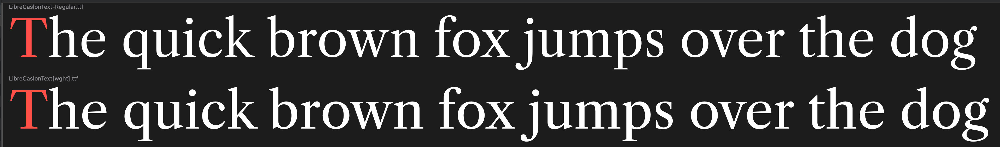
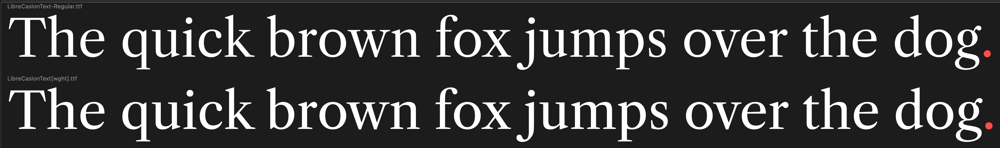
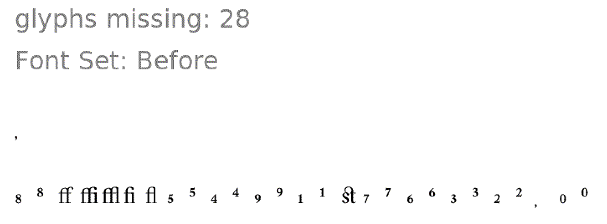
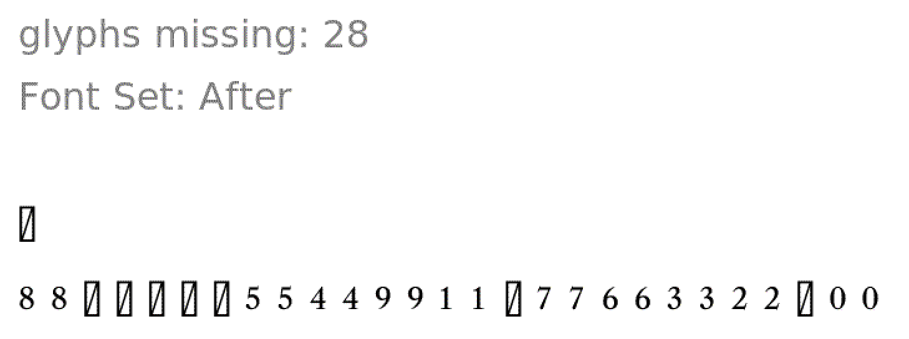

# Finishing the VF upgrade project

This variable font upgrade was started in Q4 2018, and now it is Q2 2020. Largely, this is because I was working on other projects, especially Recursive Mono & Sans. Partially, this delay was due to the font previously having Regular–Bold Romans, but only a Regular Italic (but no a Bold Italic), making it a "non-rectangular" family. Recently, however, @KatjaSchimmel has drawn a Bold Italic and greatly improved the spacing of the Regular Italic. So, it's back to mastering!

## Build

I've added a fontmake line for `sources/LibreCaslonText-Italic.glyphs` to `build.sh`, and after fixing an errant point in the glyph `Z` plus copying arrows from the Regular to the 


## Fixing

### Ligature Carets

Earlier, I had added ligature carets, but then turned them off by changing their names.

So, I changed their names back with the following macro:

```
font = Glyphs.font

def fixCarets(layer):
    for anchor in layer.anchors:
        anchor.name = anchor.name.replace("lig_","").replace("carrot","caret").replace("_temp_off","")


for glyph in font.glyphs:
    if "_" in glyph.name:
        print(glyph.name)
        for layer in glyph.layers:
            print("    ", layer.name)
        	fixCarets(layer)
```

## Sizing

Back in the earliest work on upgrading this family, I found that it was much larger in body size and line length than typical fallback fonts (see [2018-10-22-experiments](2018-10-22-experiments/README.md) for details.

However, this scaling may actually be a blocker for merging the font into Google Fonts. According to the Google Fonts site, Libre Caslon Text was served 3.97M times over the last week, and is featured in more than 11,000 websites. The size change is fairly dramatic, so that might disrupt a lot of users.

If I were to scale it back, here is how I could do so:

When both are scaled to a UPM of 2000:

|            | old   | newer | change      |
| ---------- | ----- | ----- | ----------- |
| cap height | 1540  | 1323  | 1.164021164 |

I could scale the current font by 1.164021164, scaling the UPM to 2000 * 1.164021164, or `2328.042328` (rounded to `2328`), then changing it back to 2000 without scaling. Then, I can fix vertical metrics to make them similar as well. To make current "normal" metrics easily accessible in the future (if needed), I have made a local branch of `normal-metrics` and I've pushed that to my remote.

After my first adjustment, it's actually slightly bigger than the original:



This is because I slightly adjusted the overall weight of the previous "Regular" as well, to better match the color of the Italics ([2018-11-19-finding-a-regular-weight](2018-11-19-finding-a-regular-weight)). It would be good to match the old "Regular" as closely as possible, however, because that is very likely the most-used part of the existing family.

### Trying again, scaling by overall width

```python
"""
	Script to check combined width of ASCII uppercase + lowercase.
"""

import string

alphabet = " ".join(string.ascii_letters).split(" ")

font = Glyphs.font

totalWidth = 0


for name in alphabet:
	totalWidth += font.glyphs[name].layers[0].width

print(totalWidth)
```

|            | old   | newer   | change by   |
| ---------- | ----- | ------- | ----------- |
| cap height | 66456 | 57712   | 1.151510951 |

`2000 * 1.151510951 = 2303.021902`, so I'll scale to `2303` then change back to 2000.



Much closer! Not 100% the same, but probably close enough to cause extremely little noticeable difference. The remaining differences are largely due to shifting the weight of the Regular, as mentioned above.


## Fixing missing glyphs

Some glyphs have gone “missing” from this font, according to Diffenator.





```
f_f=ff    # FB00
f_i=fi    # FB01
f_l=fl    # FB02
f_f_i=ffi # FB03
f_f_l=ffl # FB04
s_t=st    # FB06
```
