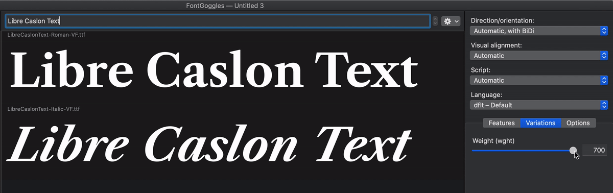

# Finishing the VF upgrade project

This variable font upgrade was started in Q4 2018, and now it is Q2 2020. Largely, this is because I was working on other projects, especially Recursive Mono & Sans. Partially, this delay was due to the font previously having Regular–Bold Romans, but only a Regular Italic (but no a Bold Italic), making it a "non-rectangular" family. Recently, however, @KatjaSchimmel has drawn a Bold Italic and greatly improved the spacing of the Regular Italic. So, it's back to mastering!

## Build

I've added a fontmake line for `sources/LibreCaslonText-Italic.glyphs` to `build.sh`, and after fixing an errant point in the glyph `Z` plus copying arrows from the Regular to the 

